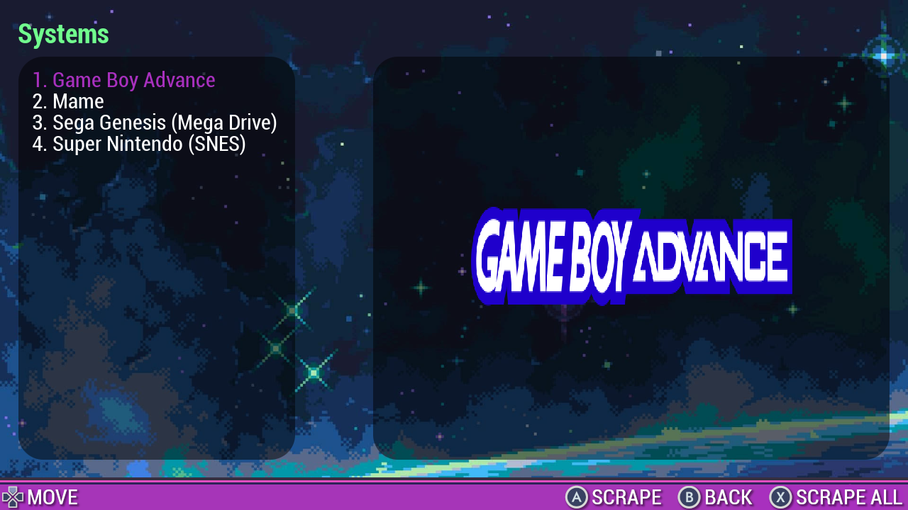

# Screech

  <p align="left">
  
  
  
  
  </p>

Screech is a game image scraper implemented in Go and SDL2 and was designed with Trimui Smart Pro in mind and uses [Screenscraper.fr](https://www.screenscraper.fr/) as the backend. It's inspired by Schmurtz [Scraper](https://github.com/schmurtzm/TrimUI-Smart-Pro/tree/main/Scraper) with the addition to be easier to configure and port to other handhelds.



# Installation
Download the binaries in the Releases section, unpack and move the folder to your device in  `SDCARD/Apps`. Reboot the device and the app should appear in the `Apps` menu.

## Configuration
Inside the app folder you'l find the `screench.yaml` file where all the app configurations are stored. You may point the Rom folder, set the screenscraper.fr username and password. Note that the console logos should be name as the same as rom dir of that systems, e.g: if your SNES roms dir is named `SFC` your logos directory should contain a `SFC.png`.

If your device/OS doesn't have console logos you may find a large colection inside `assets/logos` in this repo.

For TSP with CrossMix-OS the configuration already points to where the logos/roms/Imgs are stored and you don't need to change anything.

# Building

First you need to clone the [toolchain](https://github.com/anibaldeboni/trimui-smart-pro-toolchain) repo. It's already configured with go + SDL2 + Trimui SDK.
Then, clone the screech repo inside `path/to/toolchain/workspace`.

To run the toolchain, type
```sh
make shell
```
inside the toolchain dir. The docker will run and a shell will be opened in the workspace dir.
After this you just have to type `make` and a new folder named `Screech` will be created with the new binary and all the necessary folder

# Contributing

This project is open for contribution. If you can code in Go feel free to open a PR.
 Bugs, suggestion, feature request may be posted in the [Issues](https://github.com/anibaldeboni/screech/issues) section.


# Thanks
I'd like thank the communities [r/trimui](https://www.reddit.com/r/trimui/) and [r/SBCGgaming](https://www.reddit.com/r/SBCGaming/) for pointing some direction on how do develop for TSP, and [Arthur Gregório](https://github.com/ogregorio?tab=repositories) for helping me with some issues aroung the building process.
